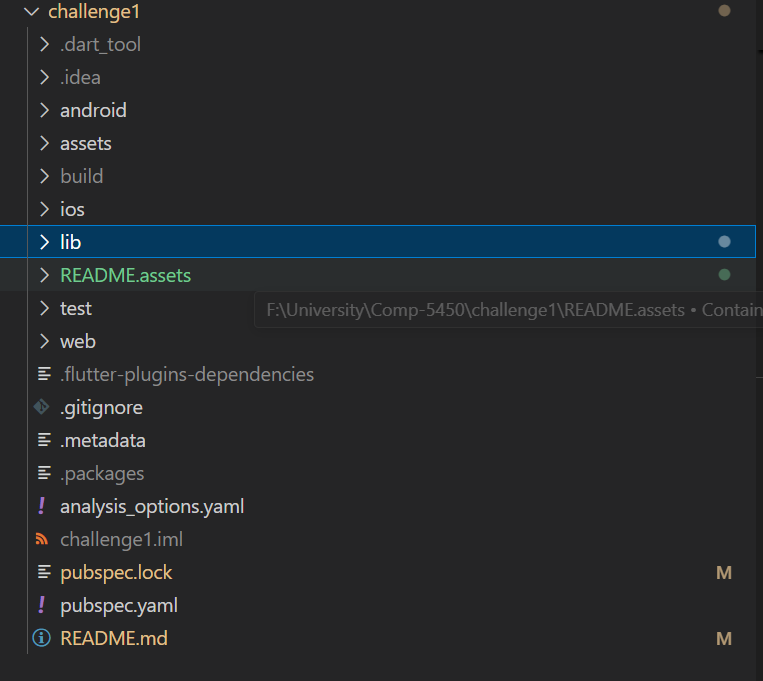
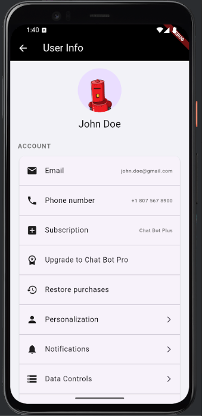

# Feature/Display-Store-Messages

This module is part of the Chat AI App, responsible for displaying and storing user messages in a chat history. It provides essential components like login, user registration, chat history management, and user profile display. The module is designed for seamless integration with the larger Chat AI project.

## Project Structure

File folder structure:



**source code:**

lib/
├── constant/
│   ├── apiKey.dart
│   └── global.dart
├── database/
│   └── chat_history_db.dart
├── pages/
│   ├── ChatHistoryPage.dart
│   ├── ChatPage.dart
│   ├── LoginPage.dart
│   ├── SignupPage.dart
│   ├── UserDatabase.dart
│   └── UserInfoPage.dart
├── widgets/
│   └── ChatHistoryWidget.dart
└── main.dart

IDE: Android studio

platform: Android, IOS, Web

## Module Components

1. Main Application (main.dart)
Entry point of the application, defining the app’s structure and main theme.

2. Constants (constant/)
apiKey.dart: Stores API keys and endpoint URLs.
global.dart: Defines global configurations like route observers.

3. Database (database/)
chat_history_db.dart: Handles SQLite database operations for storing and retrieving chat history.

4. Pages (pages/)
ChatHistoryPage.dart: Displays a list of past chat sessions.
ChatPage.dart: Core chat interface with message handling.
LoginPage.dart: User login interface.
SignupPage.dart: User registration interface.
UserDatabase.dart: Handles in-memory user authentication and registration.
UserInfoPage.dart: Displays user profile information.

5. Widgets (widgets/)
ChatHistoryWidget.dart: Custom widget for rendering chat history items.

## Key Features

### 1. User Authentication (Login & Signup)

**login page:**


- default username: admin
- default password: 1234

**Sign up page:**


- if one of the input field is empty, warning will alert in snack bar
- if user name exists, warning will alert as well

### 2. Chat History Page


functionalities:

- choose Chat model & create new chat
- load past chat history including newly created chat under the Recent History from sqlite
- navigate to user profile page


### 3. Chat Page


functionalities:

- Communicate with chatbot backend through https
- accepts audio from user and transcribe it to strings to send to the chatbot and display on screen
- record each message from user and chatbot in sqlite so that it can be displayed in chat history page
- load all chat messages on screen for this session if this is an existing past chat history

### 4. User Profile Display



# Installation & Configuration
1. Clone the repository:

   ```bash
   git clone <repository_url>
   ```

2. Open the challenge1 as the root folder in Android studio

3. Install dependencies:
   `flutter pub get`

4. Add your OpenAI API key:
   Open `lib/constant/apiKey.dart`
   Replace the API_key value with your actual OpenAI API key. The OpenAI API key can be created at this link and requires credit purchase: ([link](https://platform.openai.com/settings/organization/api-keys))

5. Choose the device to be your emulator and run the project

# Demo Video

Emulator: https://drive.google.com/file/d/1xoldZIIYY-MqAzZe1BSOC0DdtzyxZ3oq/view?usp=drive_link


# Physical Device demo

https://drive.google.com/file/d/1shsTV1T3oKmVVIuMJbwyQnhQuhtW2FT9/view?usp=drive_link

# Github link

https://github.com/junior-stack/COMP5450-Challenge1
